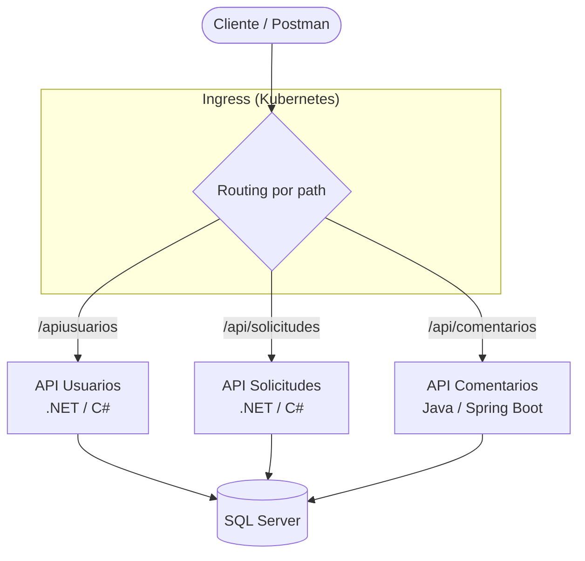

# 🧩 Microservices Orchestration — Plataforma políglota

Orquestación de **microservicios políglotas** (.NET + Java/Spring Boot) contenerizados con **Docker** y desplegables en **Kubernetes**. Proyecto de aprendizaje enfocado en contenerización, orquestación y comunicación entre servicios.

> **Estado:** funcional en local vía Docker Compose. Manifiestos de Kubernetes incluidos (deployments, services e ingress); el despliegue en K8s quedó en fase de configuración (los servicios responden vía Postman; el routing por ingress estaba en ajuste). No desplegado en cloud.

---

## 🏗️ Arquitectura

Tres servicios independientes, cada uno con su propio Dockerfile, detrás de un **ingress** que enruta por path. Persistencia en **SQL Server** contenerizado.



---

## 🧱 Servicios

| Servicio | Lenguaje / Framework | Carpeta | Ruta (ingress) | Responsabilidad |
|---|---|---|---|---|
| **API Usuarios** | .NET / ASP.NET Core | `Usuarios/ApiUsuarios` | `/apiusuarios` | Gestión de usuarios y autenticación (JWT) |
| **API Solicitudes** | .NET / ASP.NET Core | `Solicitudes/ApiSolicitudes` | `/api/solicitudes` | Gestión de solicitudes/documentos |
| **API Comentarios** | Java / Spring Boot | `Comentarios/demo` | `/api/comentarios` | Gestión de comentarios |
| **SQL Server** | Contenedor MSSQL | `sql/` | — | Persistencia compartida |

Cada servicio .NET valida JWT con clave/issuer/audience compartidos vía variables de entorno, lo que permite autenticación consistente entre microservicios.

---

## 🛠️ Stack


---

## 🚀 Cómo correrlo

### Opción A — Docker Compose (recomendado para local)

1. Crear un archivo `.env` en la raíz (ver variables más abajo).
2. Levantar los servicios:

```bash
docker-compose up --build
```

Cada API queda expuesta en el puerto definido en `.env`. La documentación Swagger de los servicios .NET está disponible en `/swagger`.

### Opción B — Kubernetes

Manifiestos en `K8s/` (un deployment + service por API, más el ingress):

```bash
kubectl apply -f K8s/
```

El ingress (`K8s/ingress.yaml`) enruta por path: `/apiusuarios`, `/api/solicitudes`, `/api/comentarios`.

---

## 🔐 Variables de entorno

El `docker-compose.yml` consume estas variables (definilas en un `.env` en la raíz; **no se commitea**):

| Variable | Propósito |
|---|---|
| `API_USUARIOS_PORT` | Puerto host para API Usuarios |
| `API_SOLICITUDES_PORT` | Puerto host para API Solicitudes |
| `API_COMENTARIOS_PORT` | Puerto host para API Comentarios |
| `CONTAINER_PORT` | Puerto interno del contenedor (8080) |
| `JWT_KEY` | Clave de firma JWT (compartida entre servicios .NET) |
| `JWT_ISSUER` | Emisor del token |
| `JWT_AUDIENCE` | Audiencia del token |

---

## 📁 Estructura

```
.
├── Usuarios/ApiUsuarios/        # Microservicio .NET — usuarios
├── Solicitudes/ApiSolicitudes/  # Microservicio .NET — solicitudes
├── Comentarios/demo/            # Microservicio Java/Spring — comentarios
├── sql/                         # Contenedor SQL Server
├── K8s/                         # Manifiestos Kubernetes (deployments, services, ingress)
├── docker-compose.yml           # Orquestación local
└── MicroS.sln                   # Solución .NET
```

---

## 📌 Aprendizajes y próximos pasos

- ✅ Contenerización de servicios en dos stacks distintos (.NET y Java) bajo una misma orquestación
- ✅ Autenticación JWT consistente entre microservicios
- ✅ Routing por ingress en Kubernetes
- 🔄 Completar el routing por ingress (consumo de endpoints desde el gateway)
- 🔄 Habilitar el contenedor de SQL Server en `docker-compose` (hoy comentado)
- 🔄 Despliegue en un cluster cloud (EKS/GKE)
